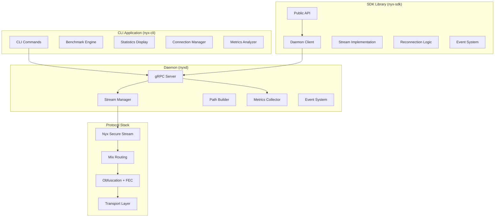

# Design Document

## Overview

This design document outlines the implementation approach for completing the CLI and SDK functionality for the Nyx project. Based on the Nyx Protocol v0.1/v1.0 specifications and the existing codebase analysis, this design focuses on enhancing the existing `nyx-cli` and `nyx-sdk` components to provide complete benchmark functionality, detailed statistics, connection features, error statistics, actual daemon communication, stream read/write capabilities, auto-reconnection, and a comprehensive event system.

The design leverages the existing architecture with the daemon (`nyxd`) as the central coordination point, providing gRPC services that the CLI and SDK will consume. The implementation will build upon the existing protocol stack including the Nyx Secure Stream Layer, Mix Routing Layer, Obfuscation + FEC Layer, and Transport Interface Layer.

## Architecture



## Components and Interfaces

### 1. CLI Enhancement (nyx-cli)

#### 1.1 Benchmark Engine
- **Purpose**: Implement actual data transmission benchmarking through Nyx streams
- **Key Components**:
  - `BenchmarkRunner`: Orchestrates benchmark execution with configurable parameters
  - `StreamBenchmark`: Handles individual stream performance testing
  - `LatencyCollector`: Collects and calculates latency statistics with percentiles
  - `ThroughputMeasurer`: Measures data transfer rates and bandwidth utilization
  - `ErrorTracker`: Categorizes and tracks errors by protocol layer

#### 1.2 Statistics Display System
- **Purpose**: Provide comprehensive network performance visualization
- **Key Components**:
  - `StatisticsRenderer`: Formats and displays statistics in tables and charts
  - `PerformanceAnalyzer`: Analyzes performance trends and provides recommendations
  - `LayerMetrics`: Displays per-layer statistics (Stream, Mix, FEC, Transport)
  - `RealTimeUpdater`: Provides live statistics updates with configurable intervals

#### 1.3 Connection Manager
- **Purpose**: Handle actual Nyx stream connections with full protocol support
- **Key Components**:
  - `ConnectionEstablisher`: Manages Noise_Nyx handshake and stream establishment
  - `DataTransferHandler`: Handles bidirectional data transfer with flow control
  - `InteractiveSession`: Provides interactive mode for real-time communication
  - `ConnectionMonitor`: Displays real-time connection metrics and hop information

#### 1.4 Metrics Analyzer
- **Purpose**: Analyze Prometheus metrics and provide troubleshooting insights
- **Key Components**:
  - `PrometheusClient`: Connects to daemon's metrics endpoint
  - `ErrorCategorizer`: Categorizes errors by Nyx protocol layers and error codes
  - `TrendAnalyzer`: Analyzes error trends and correlations
  - `RecommendationEngine`: Provides actionable troubleshooting recommendations

### 2. SDK Enhancement (nyx-sdk)

#### 2.1 Daemon Communication Layer
- **Purpose**: Replace simulation with actual gRPC communication to nyxd
- **Key Components**:
  - `NyxControlClient`: Enhanced gRPC client with connection management
  - `HealthMonitor`: Monitors daemon health and connection status
  - `RequestManager`: Handles request queuing and retry logic
  - `ErrorHandler`: Provides detailed error information and recovery options

#### 2.2 Stream Implementation
- **Purpose**: Implement actual AsyncRead/AsyncWrite over Nyx streams
- **Key Components**:
  - `NyxAsyncStream`: AsyncRead + AsyncWrite implementation
  - `FrameHandler`: Handles STREAM frame processing and reassembly
  - `FlowController`: Implements backpressure and flow control
  - `BufferManager`: Manages read/write buffers with proper sizing

#### 2.3 Reconnection System
- **Purpose**: Provide automatic reconnection with exponential backoff
- **Key Components**:
  - `ReconnectionManager`: Orchestrates reconnection attempts
  - `BackoffStrategy`: Implements jittered exponential backoff
  - `StateRestorer`: Restores session state after reconnection
  - `CircuitBreaker`: Prevents excessive reconnection attempts

#### 2.4 Event System
- **Purpose**: Comprehensive event handling for network state changes
- **Key Components**:
  - `EventDispatcher`: Thread-safe event distribution
  - `EventSubscriber`: Manages event subscriptions and callbacks
  - `EventFilter`: Filters events by type, severity, and stream ID
  - `CallbackManager`: Manages event handler lifecycle

## Data Models

### CLI Data Models

```rust
// Benchmark results with comprehensive statistics
#[derive(Debug, Serialize, Deserialize)]
pub struct BenchmarkResult {
    pub target: String,
    pub duration: Duration,
    pub total_requests: u64,
    pub successful_requests: u64,
    pub failed_requests: u64,
    pub bytes_sent: u64,
    pub bytes_received: u64,
    pub avg_latency: Duration,
    pub percentiles: LatencyPercentiles,
    pub throughput_mbps: f64,
    pub error_rate: f64,
    pub layer_metrics: LayerMetrics,
    pub timestamp: DateTime<Utc>,
}

// Latency percentile breakdown
#[derive(Debug, Serialize, Deserialize)]
pub struct LatencyPercentiles {
    pub p50: Duration,
    pub p90: Duration,
    pub p95: Duration,
    pub p99: Duration,
    pub p99_9: Duration,
}

// Per-layer performance metrics
#[derive(Debug, Serialize, Deserialize)]
pub struct LayerMetrics {
    pub stream_layer: LayerPerformance,
    pub mix_layer: LayerPerformance,
    pub fec_layer: LayerPerformance,
    pub transport_layer: LayerPerformance,
}

#[derive(Debug, Serialize, Deserialize)]
pub struct LayerPerformance {
    pub latency_ms: f64,
    pub throughput_mbps: f64,
    pub error_count: u64,
    pub success_rate: f64,
}

// Prometheus metrics analysis
#[derive(Debug, Serialize, Deserialize)]
pub struct MetricsAnalysis {
    pub time_range: String,
    pub total_requests: u64,
    pub error_count: u64,
    pub error_rate: f64,
    pub error_breakdown: HashMap<String, ErrorCategory>,
    pub latency_metrics: LatencyMetrics,
    pub throughput_metrics: ThroughputMetrics,
    pub availability_metrics: AvailabilityMetrics,
    pub recommendations: Vec<String>,
}

#[derive(Debug, Serialize, Deserialize)]
pub struct ErrorCategory {
    pub count: u64,
    pub percentage: f64,
    pub layer: String,
    pub description: String,
    pub suggested_actions: Vec<String>,
}
```

### SDK Data Models

```rust
// Stream configuration and options
#[derive(Debug, Clone)]
pub struct StreamOptions {
    pub target_address: String,
    pub stream_name: String,
    pub timeout: Duration,
    pub buffer_size: usize,
    pub enable_reconnect: bool,
    pub max_reconnect_attempts: u32,
    pub reconnect_backoff: BackoffConfig,
}

// Stream state tracking
#[derive(Debug, Clone, PartialEq)]
pub enum StreamState {
    Idle,
    Connecting,
    Connected,
    Reconnecting,
    Closed,
    Error(String),
}

// Event types for the event system
#[derive(Debug, Clone)]
pub enum NyxEvent {
    StreamOpened { stream_id: String, target: String },
    StreamClosed { stream_id: String, reason: String },
    ConnectionLost { stream_id: String, error: String },
    ConnectionRestored { stream_id: String },
    PathChanged { stream_id: String, new_path: Vec<String> },
    ErrorOccurred { stream_id: String, error: NyxError, layer: String },
    PerformanceAlert { metric: String, value: f64, threshold: f64 },
}

// Reconnection configuration
#[derive(Debug, Clone)]
pub struct BackoffConfig {
    pub initial_delay: Duration,
    pub max_delay: Duration,
    pub multiplier: f64,
    pub jitter: bool,
}

// Connection information
#[derive(Debug, Clone)]
pub struct ConnectionInfo {
    pub stream_id: String,
    pub target_address: String,
    pub state: StreamState,
    pub connected_at: Option<DateTime<Utc>>,
    pub bytes_sent: u64,
    pub bytes_received: u64,
    pub current_path: Vec<String>,
    pub rtt_ms: f64,
}
```

## Error Handling

### Error Categories

1. **Protocol Errors**: Nyx protocol-specific errors with error codes from the specification
2. **Network Errors**: Transport layer failures, NAT traversal issues, connectivity problems
3. **Authentication Errors**: Handshake failures, key exchange problems
4. **Resource Errors**: Memory limits, file descriptor exhaustion, rate limiting
5. **Configuration Errors**: Invalid settings, missing configuration, version mismatches

### Error Recovery Strategies

1. **Automatic Retry**: For transient network errors with exponential backoff
2. **Graceful Degradation**: Fallback to cached data or reduced functionality
3. **Circuit Breaking**: Prevent cascading failures with configurable thresholds
4. **User Notification**: Clear error messages with actionable recommendations

## Testing Strategy

### Unit Testing
- **CLI Components**: Test each command with mocked daemon responses
- **SDK Components**: Test stream operations with simulated network conditions
- **Error Handling**: Verify proper error propagation and recovery
- **Event System**: Test event filtering and callback execution

### Integration Testing
- **CLI-Daemon Integration**: Test actual gRPC communication
- **SDK-Daemon Integration**: Test stream establishment and data transfer
- **Reconnection Logic**: Test network interruption scenarios
- **Performance Testing**: Verify benchmark accuracy and statistics

### End-to-End Testing
- **Multi-Node Testing**: Test with actual Nyx network topology
- **Load Testing**: Verify performance under high connection counts
- **Failure Testing**: Test behavior during daemon restarts and network partitions
- **Compatibility Testing**: Ensure compatibility with different daemon versions

## Performance Considerations

### CLI Performance
- **Concurrent Connections**: Use tokio for async connection management
- **Memory Efficiency**: Stream processing for large data transfers
- **Display Optimization**: Efficient table rendering and real-time updates
- **Metrics Collection**: Minimize overhead during benchmarking

### SDK Performance
- **Zero-Copy Operations**: Minimize data copying in stream operations
- **Connection Pooling**: Reuse connections where possible
- **Buffer Management**: Optimal buffer sizes for different use cases
- **Event Processing**: Efficient event dispatch without blocking

### Resource Management
- **Memory Usage**: Bounded buffers and connection limits
- **File Descriptors**: Proper cleanup and resource management
- **CPU Usage**: Efficient algorithms for statistics calculation
- **Network Usage**: Minimize control plane overhead

## Security Considerations

### Data Protection
- **In-Transit Encryption**: All data encrypted using Nyx protocol
- **Key Management**: Secure handling of cryptographic material
- **Authentication**: Proper daemon authentication and authorization
- **Input Validation**: Sanitize all user inputs and network data

### Attack Mitigation
- **DoS Protection**: Rate limiting and resource bounds
- **Injection Prevention**: Parameterized queries and safe parsing
- **Information Disclosure**: Minimize sensitive information in logs
- **Privilege Separation**: Run with minimal required permissions

## Deployment and Configuration

### CLI Deployment
- **Binary Distribution**: Single binary with embedded resources
- **Configuration**: Support for config files and environment variables
- **Internationalization**: Multi-language support with fluent
- **Platform Support**: Cross-platform compatibility (Linux, macOS, Windows)

### SDK Integration
- **Crate Distribution**: Published to crates.io with semantic versioning
- **Documentation**: Comprehensive API documentation with examples
- **Feature Flags**: Optional features for different use cases
- **Compatibility**: Support for multiple daemon versions

### Configuration Management
- **Default Settings**: Sensible defaults for all configuration options
- **Validation**: Comprehensive configuration validation
- **Hot Reload**: Support for runtime configuration updates
- **Environment Integration**: Integration with system configuration