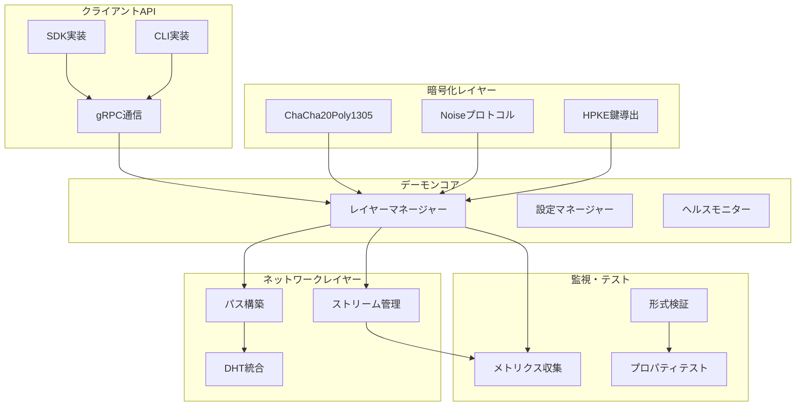

# 設計文書

## 概要

この設計文書は、NyxNetコードベース全体の未実装、プレースホルダー、スタブ実装を完成させるための包括的なアプローチを定義します。設計は8つの主要領域に焦点を当て、各領域で完全な実装を提供し、システム全体の統合性と信頼性を確保します。

## アーキテクチャ

### 全体アーキテクチャ



### レイヤー統合アーキテクチャ

各プロトコルレイヤーは`LayerManager`を通じて調整され、以下の責任を持ちます：

1. **暗号化レイヤー** - 鍵管理、暗号化/復号化、認証
2. **ストリームレイヤー** - 接続管理、フロー制御、データ転送
3. **ミックスレイヤー** - パケットルーティング、匿名化
4. **FECレイヤー** - エラー訂正、パケット回復
5. **トランスポートレイヤー** - ネットワーク通信、接続管理

## コンポーネントと インターフェース

### 1. 暗号化コンポーネント

#### HPKEキー導出実装
```rust
pub struct HpkeKeyDeriver {
    suite: hpke::Kem,
    kdf: hpke::Kdf,
    aead: hpke::Aead,
}

impl HpkeKeyDeriver {
    pub fn derive_keypair(&self) -> Result<(PrivateKey, PublicKey), CryptoError>;
    pub fn encapsulate(&self, pk: &PublicKey) -> Result<(SharedSecret, EncapsulatedKey), CryptoError>;
    pub fn decapsulate(&self, sk: &PrivateKey, enc: &EncapsulatedKey) -> Result<SharedSecret, CryptoError>;
}
```

#### Noiseプロトコル実装
```rust
pub struct NoiseHandshake {
    state: HandshakeState,
    pattern: HandshakePattern,
}

impl NoiseHandshake {
    pub fn new_initiator() -> Result<Self, NoiseError>;
    pub fn new_responder() -> Result<Self, NoiseError>;
    pub fn write_message(&mut self, payload: &[u8], message: &mut [u8]) -> Result<usize, NoiseError>;
    pub fn read_message(&mut self, message: &[u8], payload: &mut [u8]) -> Result<usize, NoiseError>;
    pub fn into_transport_mode(self) -> Result<NoiseTransport, NoiseError>;
}
```

### 2. デーモンレイヤー統合

#### レイヤーマネージャー
```rust
pub struct LayerManager {
    crypto_layer: Arc<CryptoLayer>,
    stream_layer: Arc<StreamLayer>,
    mix_layer: Arc<MixLayer>,
    fec_layer: Arc<FecLayer>,
    transport_layer: Arc<TransportLayer>,
    event_bus: Arc<EventBus>,
}

impl LayerManager {
    pub async fn start(&mut self) -> Result<(), LayerError>;
    pub async fn stop(&mut self) -> Result<(), LayerError>;
    pub async fn restart_layer(&mut self, layer: LayerType) -> Result<(), LayerError>;
    pub fn get_layer_status(&self, layer: LayerType) -> LayerStatus;
}
```

#### イベントバス
```rust
pub struct EventBus {
    subscribers: HashMap<EventType, Vec<Box<dyn EventHandler>>>,
    event_queue: Arc<Mutex<VecDeque<Event>>>,
}

impl EventBus {
    pub fn subscribe(&mut self, event_type: EventType, handler: Box<dyn EventHandler>);
    pub async fn publish(&self, event: Event);
    pub async fn process_events(&self);
}
```

### 3. ネットワークシミュレーション

#### ネットワークシミュレーター
```rust
pub struct NetworkSimulator {
    topology: NetworkTopology,
    conditions: NetworkConditions,
    packet_scheduler: PacketScheduler,
}

impl NetworkSimulator {
    pub fn new(config: SimulationConfig) -> Self;
    pub async fn simulate_packet_loss(&self, rate: f64);
    pub async fn simulate_latency(&self, distribution: LatencyDistribution);
    pub async fn simulate_bandwidth_limit(&self, limit_mbps: f64);
    pub async fn simulate_network_partition(&self, nodes: Vec<NodeId>);
}
```

#### プロパティテストフレームワーク
```rust
pub struct PropertyTester {
    generators: HashMap<String, Box<dyn Generator>>,
    properties: Vec<Box<dyn Property>>,
}

impl PropertyTester {
    pub fn add_property<P: Property + 'static>(&mut self, property: P);
    pub async fn run_tests(&self, iterations: usize) -> TestResults;
    pub fn generate_counterexample(&self, failure: &TestFailure) -> CounterExample;
}
```

### 4. ストリーム管理

#### AsyncRead/AsyncWrite実装
```rust
pub struct NyxAsyncStream {
    stream_id: u32,
    read_buffer: BytesMut,
    write_buffer: BytesMut,
    flow_controller: FlowController,
    frame_handler: FrameHandler,
}

impl AsyncRead for NyxAsyncStream {
    fn poll_read(
        self: Pin<&mut Self>,
        cx: &mut Context<'_>,
        buf: &mut ReadBuf<'_>,
    ) -> Poll<io::Result<()>>;
}

impl AsyncWrite for NyxAsyncStream {
    fn poll_write(
        self: Pin<&mut Self>,
        cx: &mut Context<'_>,
        buf: &[u8],
    ) -> Poll<Result<usize, io::Error>>;
    
    fn poll_flush(self: Pin<&mut Self>, cx: &mut Context<'_>) -> Poll<Result<(), io::Error>>;
    fn poll_shutdown(self: Pin<&mut Self>, cx: &mut Context<'_>) -> Poll<Result<(), io::Error>>;
}
```

#### フロー制御
```rust
pub struct FlowController {
    window_size: u32,
    bytes_in_flight: u32,
    congestion_window: u32,
    rtt_estimator: RttEstimator,
}

impl FlowController {
    pub fn can_send(&self, bytes: u32) -> bool;
    pub fn on_data_sent(&mut self, bytes: u32);
    pub fn on_ack_received(&mut self, acked_bytes: u32, rtt: Duration);
    pub fn on_packet_lost(&mut self, lost_bytes: u32);
}
```

### 5. メトリクス収集

#### 包括的メトリクス
```rust
pub struct ComprehensiveMetrics {
    layer_metrics: HashMap<LayerType, LayerMetrics>,
    system_metrics: SystemMetrics,
    network_metrics: NetworkMetrics,
    error_metrics: ErrorMetrics,
}

impl ComprehensiveMetrics {
    pub fn collect_all(&mut self) -> MetricsSnapshot;
    pub fn export_prometheus(&self) -> String;
    pub fn generate_alerts(&self) -> Vec<Alert>;
    pub fn analyze_performance(&self) -> PerformanceAnalysis;
}
```

#### Prometheusエクスポーター
```rust
pub struct PrometheusExporter {
    registry: Registry,
    metrics: HashMap<String, Box<dyn PrometheusMetric>>,
}

impl PrometheusExporter {
    pub fn register_metric<M: PrometheusMetric + 'static>(&mut self, name: String, metric: M);
    pub fn export(&self) -> String;
    pub fn start_server(&self, addr: SocketAddr) -> Result<(), ExportError>;
}
```

### 6. 形式検証統合

#### TLA+モデル実行器
```rust
pub struct TlaModelRunner {
    model_path: PathBuf,
    config: TlcConfig,
    tlaps_config: TlapsConfig,
}

impl TlaModelRunner {
    pub async fn run_model_check(&self) -> Result<ModelCheckResult, TlaError>;
    pub async fn run_proof_check(&self) -> Result<ProofCheckResult, TlaError>;
    pub fn generate_coverage_report(&self) -> CoverageReport;
}
```

#### 不変条件チェッカー
```rust
pub struct InvariantChecker {
    invariants: Vec<Box<dyn Invariant>>,
    state_tracker: StateTracker,
}

impl InvariantChecker {
    pub fn add_invariant<I: Invariant + 'static>(&mut self, invariant: I);
    pub fn check_state(&self, state: &SystemState) -> Vec<InvariantViolation>;
    pub fn generate_counterexample(&self, violation: &InvariantViolation) -> CounterExample;
}
```

### 7. CLI/SDK実装

#### 実際のgRPC通信
```rust
pub struct NyxDaemonClient {
    client: NyxControlClient<Channel>,
    connection_manager: ConnectionManager,
    retry_policy: RetryPolicy,
}

impl NyxDaemonClient {
    pub async fn connect(endpoint: String) -> Result<Self, ClientError>;
    pub async fn open_stream(&mut self, request: OpenRequest) -> Result<StreamResponse, ClientError>;
    pub async fn get_stats(&mut self) -> Result<NodeInfo, ClientError>;
    pub async fn subscribe_events(&mut self) -> Result<EventStream, ClientError>;
}
```

#### 自動再接続システム
```rust
pub struct ReconnectionManager {
    backoff_strategy: ExponentialBackoff,
    max_attempts: u32,
    circuit_breaker: CircuitBreaker,
}

impl ReconnectionManager {
    pub async fn attempt_reconnection<F, Fut>(&mut self, connect_fn: F) -> Result<(), ReconnectionError>
    where
        F: Fn() -> Fut,
        Fut: Future<Output = Result<(), ConnectionError>>;
}
```

### 8. パス構築

#### 実際のDHT統合
```rust
pub struct DhtPeerDiscovery {
    dht_client: DhtClient,
    peer_cache: LruCache<NodeId, PeerInfo>,
    discovery_strategy: DiscoveryStrategy,
}

impl DhtPeerDiscovery {
    pub async fn discover_peers(&mut self, criteria: DiscoveryCriteria) -> Result<Vec<PeerInfo>, DhtError>;
    pub async fn resolve_node(&mut self, node_id: NodeId) -> Result<PeerInfo, DhtError>;
    pub fn update_peer_info(&mut self, peer: PeerInfo);
}
```

#### 地理的多様性
```rust
pub struct GeographicPathBuilder {
    location_service: LocationService,
    diversity_config: DiversityConfig,
    path_optimizer: PathOptimizer,
}

impl GeographicPathBuilder {
    pub async fn build_diverse_path(&self, target: NodeId, hops: u32) -> Result<Path, PathBuildError>;
    pub fn calculate_diversity_score(&self, path: &Path) -> f64;
    pub fn optimize_for_geography(&self, candidates: Vec<NodeId>) -> Vec<NodeId>;
}
```

## データモデル

### 暗号化データ構造
```rust
pub struct CryptoContext {
    pub hpke_suite: HpkeSuite,
    pub noise_state: NoiseState,
    pub session_keys: SessionKeys,
    pub key_rotation_schedule: KeyRotationSchedule,
}

pub struct SessionKeys {
    pub send_key: [u8; 32],
    pub recv_key: [u8; 32],
    pub send_nonce: u64,
    pub recv_nonce: u64,
}
```

### ネットワーク状態
```rust
pub struct NetworkState {
    pub topology: NetworkTopology,
    pub active_connections: HashMap<ConnectionId, Connection>,
    pub routing_table: RoutingTable,
    pub peer_database: PeerDatabase,
}

pub struct Connection {
    pub id: ConnectionId,
    pub state: ConnectionState,
    pub crypto_context: CryptoContext,
    pub stream_manager: StreamManager,
    pub metrics: ConnectionMetrics,
}
```

### メトリクスデータ
```rust
pub struct MetricsSnapshot {
    pub timestamp: SystemTime,
    pub layer_metrics: HashMap<LayerType, LayerMetrics>,
    pub system_metrics: SystemMetrics,
    pub network_metrics: NetworkMetrics,
    pub performance_metrics: PerformanceMetrics,
}

pub struct LayerMetrics {
    pub layer_type: LayerType,
    pub status: LayerStatus,
    pub throughput: f64,
    pub latency: Duration,
    pub error_rate: f64,
    pub resource_usage: ResourceUsage,
}
```

## エラー処理

### 階層化エラー処理
```rust
#[derive(Debug, thiserror::Error)]
pub enum NyxError {
    #[error("Crypto error: {0}")]
    Crypto(#[from] CryptoError),
    
    #[error("Network error: {0}")]
    Network(#[from] NetworkError),
    
    #[error("Stream error: {0}")]
    Stream(#[from] StreamError),
    
    #[error("Configuration error: {0}")]
    Config(#[from] ConfigError),
    
    #[error("System error: {0}")]
    System(#[from] SystemError),
}
```

### エラー回復戦略
```rust
pub struct ErrorRecoveryManager {
    strategies: HashMap<ErrorType, Box<dyn RecoveryStrategy>>,
    circuit_breakers: HashMap<ComponentId, CircuitBreaker>,
}

impl ErrorRecoveryManager {
    pub async fn handle_error(&mut self, error: NyxError) -> RecoveryResult;
    pub fn register_strategy<S: RecoveryStrategy + 'static>(&mut self, error_type: ErrorType, strategy: S);
}
```

## テスト戦略

### 統合テスト
- 各レイヤー間の相互作用テスト
- エンドツーエンドシナリオテスト
- 障害注入テスト
- パフォーマンステスト

### プロパティベーステスト
- 暗号化プロパティの検証
- ネットワークプロトコルの正確性
- 状態遷移の妥当性
- 不変条件の維持

### 形式検証
- TLA+モデルによる安全性証明
- TLAPSによる活性証明
- モデルチェックによる状態空間探索
- 反例生成と分析

この設計により、NyxNetの全コンポーネントが完全に実装され、統合され、検証されたシステムが構築されます。