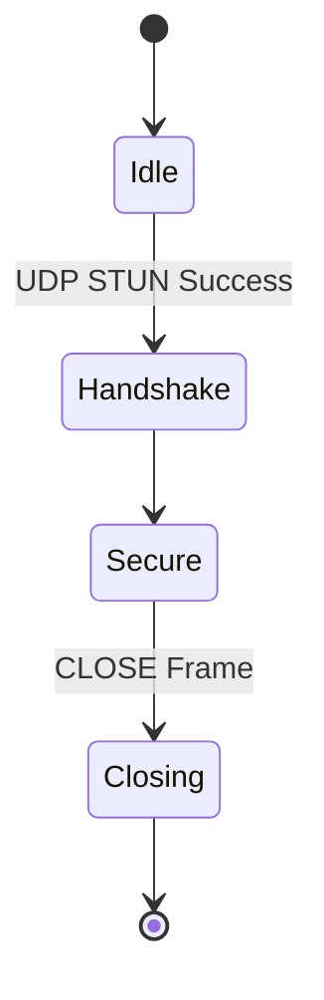

# Nyx Protocol v0.1 参照実装設計書 / Reference Implementation Design Document

> **対象リポジトリ: `NyxNet/`**  
> **実装言語: Rust (edition 2021, unsafe 0)**

---

## 目次
1. ドキュメント目的
2. 全体アーキテクチャ
3. コンポーネント分割
4. モジュール詳細設計  
   4.1 Core Runtime  
   4.2 Crypto Engine  
   4.3 Stream Layer  
   4.4 Mix Routing  
   4.5 Obfuscation & FEC  
   4.6 Transport Adapter  
   4.7 Control Plane (DHT/Rendezvous)  
   4.8 CLI & SDK  
   4.9 Telemetry & Observability
5. データフロー & 状態遷移
6. 非機能要件と対応策
7. 開発環境 & CI/CD
8. テスト戦略
9. デプロイモデル & オーケストレーション
10. セキュリティ実装指針
11. 国際化 (I18N/L10N)
12. スケーラビリティとパフォーマンス最適化
13. 移植性 (WASM / Embedded)
14. 今後の拡張ポイント
15. API 仕様 (gRPC & SDK)
16. 設定ファイル (TOML) スキーマ
17. ロギング & メトリクスフォーマット
18. データベーススキーマ (sled key-value)
19. コードスタイル & Lint ルール
20. 依存ライブラリ & バージョン固定方針
21. ビルドプロファイル
22. コンテナセキュリティ
23. インシデントレスポンス手順
24. ドキュメント生成
25. 役割分担 & コントリビュートガイド

---

## 1. ドキュメント目的
本設計書は、`Nyx_Protocol_v0.1_Spec.md` で定義された仕様を具体的な Rust 実装として落とし込むための技術設計を記述する。コントリビュータは本書を参照し、一貫したコーディング規約・モジュール境界・ビルド手順を遵守することで高性能かつ安全な実装を実現できる。

---

## 2. 全体アーキテクチャ
```mermaid
graph TD
    subgraph User Space
        CLI[nyx-cli]
        APP[App using SDK]
    end
    CLI -->|gRPC| Daemon
    APP -->|SDK API| Daemon
    subgraph Daemon (nyxd)
        subgraph Tokio Tasks
            TR(TransportAdapter)
            SS(StreamLayer)
            MR(MixRouting)
            OF(ObfuscationFEC)
            CE(CryptoEngine)
            CP(ControlPlane)
            TM(Telemetry)
        end
    end
    Daemon --> FS[(RocksDB/ sled)]
    TM --> ELK[Metrics Backend]
```
* **nyxd**: 常駐サービス。各コンポーネントを非同期タスクとして `tokio` runtime 上で稼働。
* CLI/SDK: ユーザランドアプリが gRPC over Unix Domain Socket 経由でデーモン操作。
* Persistent data (DHTキャッシュ、peer情報) は `sled` (or RocksDB) へ保存。

---

## 3. コンポーネント分割
| Crate | 役割 | 依存 | binary/lib |
|-------|------|------|-----------|
| `nyx-core` | 共通型、エラー、設定 | - | lib |
| `nyx-crypto` | Noise, AEAD, KDF 実装 | `ring`, `blake3`, `pqcrypto` | lib |
| `nyx-stream` | フレーム処理、フロー制御 | core, crypto | lib |
| `nyx-mix` | ルーティング、カバートラフィック | stream | lib |
| `nyx-fec` | RS-FEC, パディング | core | lib |
| `nyx-transport` | UDP/NAT トラバーサル, ICE Lite | core | lib |
| `nyx-control` | Kademlia DHT, rendezvous, settings sync | transport, crypto | lib |
| `nyx-daemon` | `nyxd` メイン | all libs | bin |
| `nyx-cli` | CLI ツール | tonic, core | bin |
| `nyx-sdk` | アプリ統合用 API | core, stream | lib |

---

## 4. モジュール詳細設計
### 4.1 Core Runtime (`nyx-core`)
* **Config**: TOML ロード→`Arc<Config>` で共有。hot-reload via `notify` crate。
* **Error Handling**: `thiserror` + `anyhow`. public error enums per crate。
* **Tracing**: `tracing` クレートで span/イベント出力、`tracing-opentelemetry` 経由で OTLP。
* **Async primitives**: `tokio::sync::{mpsc, oneshot, watch}` をラップした thin abstraction.

### 4.2 Crypto Engine (`nyx-crypto`)
* **Noise_Nyx**: `snow` crateを fork し、Kyber fallback を feature flag で追加。
* **Key Store**: Ephemeral keys in memory (zeroize on drop), long-term keys in file with age-encrypt.
* **HKDF Module**: `ring::hkdf` wrapper。Label enum で misuse resistance。

### 4.3 Stream Layer (`nyx-stream`)
* **State Machine**: `enum StreamState { Idle, Open, HalfClosed, Closed }`。
* **Frame Parsing**: Nom-based zero-copy parsing、validation cost O(1)。
* **Flow Control**: BBRv2 param(§19) 実装、per-CID `RwLock<CongestionCtrl>`。

### 4.4 Mix Routing (`nyx-mix`)
* **PathBuilder**: Kademlia lookup → WeightedRandomChoice。`
* **Mixer Task**: 固定Δタイマー (`tokio::time::interval`) でパケット batch → shuffle.
* **CoverGenerator**: Poisson λ 計算 = target_bw * α (configurable 0.3)。

### 4.5 Obfuscation & FEC (`nyx-fec`)
* **RS Codec**: `reed-solomon-erasure` crate。1280B ブロック→シャード分割。
* **Padding**: StreamingPadder が `AsyncRead` を実装し、リアルタイム長埋め。

### 4.6 Transport Adapter (`nyx-transport`)
* **UDP Socket Pool**: 一つの `UdpSocket` + `reuse_port` でマルチスレッド受信。
* **NAT Traversal**: `nice_ice` crate改 + 自前 STUN/TURN fallback。
* **Path Validation**: PATH_CHALLENGE/RESPONSE フレームをタスク管理。

### 4.7 Control Plane (`nyx-control`)
* **DHT**: `rust-libp2p-kad` を wrap。Record 名前空間 `nyx/peer`。
* **Settings Sync**: SETTINGS フレーム生成・apply; watch channel で他タスクに通知。
* **Metrics Export**: Prometheus exporter.

### 4.8 CLI & SDK
* **CLI** (`nyx-cli`): subcommand `keygen`, `connect`, `status`, `bench`。
* **SDK**: `NyxStream` (`AsyncRead + AsyncWrite`), `NyxConfig` builder, event callbacks。

### 4.9 Telemetry (`nyx-daemon::telemetry`)
* Logs: JSON (bunyan) + rotation。
* Metrics: Prometheus, Grafana dashboard デフォルト提供。

---

## 5. データフロー & 状態遷移

* 上位ストリームは Secure 状態でのみ `open_stream()` 可。

---

## 6. 非機能要件と対応策
| 要件 | 目標 | 実装策 |
|------|------|--------|
| 性能 | 1Gbps 単ノード | zero-copy buffers, NIC RSS + multi-thread | 
| 可観測性 | 95% コード経路に tracing | `#[instrument]` macro 適用 |
| 可用性 | crash-free >99.99% | panic = abort & systemd restart + journal dump |
| メモリ | peak <512 MiB | slab allocator + buffer pool |

---

## 7. 開発環境 & CI/CD
* **Rust toolchain**: nightly + `cargo clippy --deny warnings`。
* **CI**: GitHub Actions
  * lint → test → miri → fuzz (cron) → doc → docker build.
* **CD**: GitHub Release → `ghcr.io/nyxproject/nyxd:tag` 自動 push。

---

## 8. テスト戦略
1. **ユニットテスト**: each crate, coverage 90%.
2. **プロパティテスト**: `proptest` for frame parse, noise handshake.
3. **Fuzz**: AFL++ on frame parser, cargo-fuzz.
4. **結合テスト**: two ‑-test-node containers via docker-compose.
5. **E2E**: k8s KinD 5ノード、GitHub CI matrix。
6. **性能ベンチ**: Criterion.rs + `cargo flamegraph`.

---

## 9. デプロイモデル & オーケストレーション
* **Binary**: `nyxd`, statically linked musl optional。
* **Docker**: `Dockerfile` multi-stage; minimal (alpine w/ musl) 25MiB image。
* **Kubernetes**: Helm chart; ConfigMap for nyx.toml; Service type=LoadBalancer for rendezvous.
* **Systemd**: `nyxd.service` 提供; `DynamicUser=yes`。

---

## 10. セキュリティ実装指針
* `#![forbid(unsafe_code)]`, `cargo deny` license scan。
* Constant-time crypto operations; use `subtle` crate.
* Secrets in memory use `zeroize`.
* Defense in depth: seccomp (Linux), pledge/unveil (OpenBSD) when available。

---

## 11. 国際化 (I18N/L10N)
* CLI/SDK のメッセージは `fluent` ライブラリでローカライズ。
* デフォルト ja-JP、en-US、zh-CN 提供。

---

## 12. スケーラビリティ & パフォーマンス最適化
* Lock-free ring buffer (`crossbeam`) for high-rate packet queue。
* Batch send on UDP via `send_mmsg` (platform conditional)。
* SIMD accelerated Reed-Solomon with `stdsimd`.

---

## 13. 移植性
* **WASM**: `nyx-sdk-wasm` targeting WebTransport; compile with `wasm32-unknown-unknown`。
* **Embedded**: `no_std` subset (`nyx-lite`) ビルドフラグで動的メモリ削減。

---

## 14. 今後の拡張ポイント
* **PQ Suite 完全切替** (Kyber/Bike) 
* **Multipath**: 同時多経路でスループット向上。
* **QUIC DATAGRAM** 連携で取り出し API 拡充。
* **Verifiable Delay Mix**: cMix との統合検討。

---

## 15. API 仕様 (gRPC & SDK)
### 15.1 gRPC Service 定義
```protobuf
syntax = "proto3";
package nyx.api;
option go_package = "github.com/nyxproject/nyx/api";

message NodeInfo {
  string node_id = 1;
  string version = 2;
  uint32 uptime_sec = 3;
  uint64 bytes_in = 4;
  uint64 bytes_out = 5;
}

service NyxControl {
  rpc GetInfo(google.protobuf.Empty) returns (NodeInfo);
  rpc OpenStream(OpenRequest) returns (StreamResponse);
  rpc CloseStream(StreamId) returns (google.protobuf.Empty);
  rpc SubscribeEvents(EventFilter) returns (stream Event);
}
```
* **エラー Handling**: `google.rpc.Status` with Nyx error codes (§20).
* **Streaming**: Data は separate QUIC stream; gRPC は制御のみ。

### 15.2 SDK API (Rust)
```rust
let cfg = NyxConfig::load("~/.config/nyx.toml")?;
let mut daemon = NyxDaemon::spawn(cfg).await?;
let (mut tx, mut rx) = daemon.open_stream("chat").await?;

while let Some(msg) = rx.next().await {
    println!("<< {}", msg.text());
}
```

---

## 16. 設定ファイル (TOML) スキーマ
```toml
[node]
listen_port = 43300
max_streams = 1024

[crypto]
key_path = "~/.nyx/keys.json"
pq_enabled = false

[mix]
cover_ratio = 0.35
route_len = 5

[telemetry]
log_level = "info"
exporter = "prometheus:9090"
```
* `toml::Table` + `serde` derive; unknown keys = warning, ignore.

---

## 17. ロギング & メトリクスフォーマット
* **Log line** (bunyan):
```json
{"ts":"2025-01-01T12:00:00Z","lvl":"INFO","cid":"ab12…","msg":"stream opened","stream_id":42}
```
* **Prometheus Metrics**: namespace `nyx_`
  * `nyx_bytes_sent_total{cid="…"}`
  * `nyx_handshake_latency_seconds_bucket{le="0.05"}`

---

## 18. データベーススキーマ (sled key-value)
| Prefix | Key | Value | TTL |
|--------|-----|-------|-----|
| `p` | NodeID (32B) | Protobuf(NodeRecord) | 24h |
| `c` | CID (12B) | StreamMeta | Session |
| `s` | SettingID | u32 | persistent |

Compaction every 6h; encryption via `aes-gcm-siv` with node secret.

---

## 19. コードスタイル & Lint ルール
* `rustfmt.toml`: max_width=100, edition2021.
* `clippy.toml`: deny(warnings,clippy::all,clippy::pedantic).
* `git` hook `pre-commit`: fmt, clippy, tests.

---

## 20. 依存ライブラリ & バージョン固定方針
* `cargo update -Z minimal-versions` in CI。
* `Cargo.lock` committed、Dependabot weekly PR。
* Critical crates pinned (`ring=0.17.x`).

---

## 21. ビルドプロファイル
| Profile | 最適化 | 特徴 |
|---------|--------|------|
| `dev` | opt-level 0 | debug info, tracing=debug |
| `release` | opt-level "z" | LTO, strip symbols |
| `secure` | opt-level 3 | `panic=abort`, `codegen-units=1`, RPATH disabled |
| `embed` | nostd, alloc enabled | size-optimized |

---

## 22. コンテナセキュリティ
* Base image `gcr.io/distroless/cc`.
* Run as non-root UID 1337, read-only FS, `CAP_NET_BIND_SERVICE` only。
* seccomp profile generated via `oci-seccomp-bpf-hook`。

---

## 23. インシデントレスポンス手順
1. Detect anomaly via Prometheus alert.
2. Retrieve panic stack from journald coredump.
3. Rotate node secret (`nyx-cli key rotate`).
4. Use `nyx-cli quarantine <node>` to remove compromised node from DHT.

---

## 24. ドキュメント生成
* `cargo doc --no-deps -Zunstable-options --config features=doc_cfg`。
* Publish to GitHub Pages via `mkdocs-material` bridging Rustdoc → Markdown。

---

## 25. 役割分担 & コントリビュートガイド
* **Maintainers**: @SeleniaProject (Lead), @core-devs.
* **PR Workflow**: issue → draft PR → CI green → review2+.
* **Commit Message** Conventional Commits.
* **CLA**: DCO + sign-off required.

---