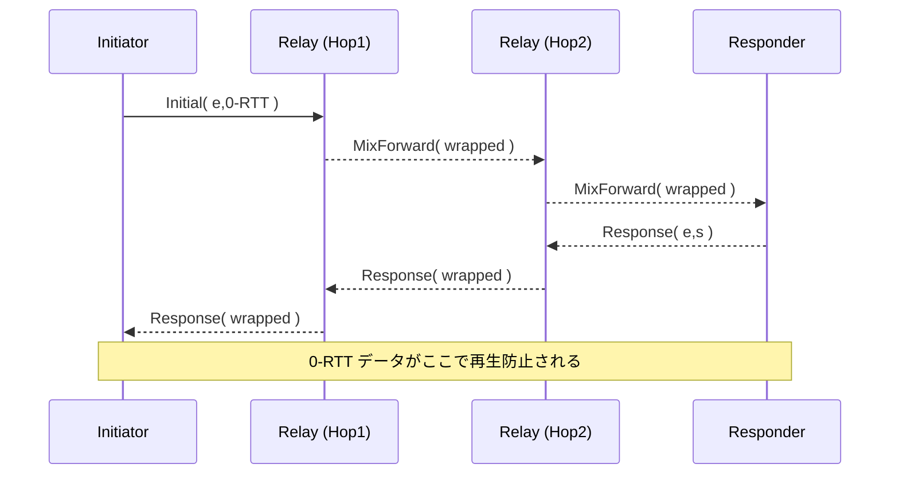

# Nyx Protocol v0.1 — 技術仕様書 / Technical Specification

> **“世界最高の匿名性・秘匿性・速度をすべて両立する、新たな通信プロトコル。”**  
> (A next-generation anonymous transport protocol that unifies maximum privacy, secrecy, and performance.)

---

## 目次 / Table of Contents
1. はじめに (Introduction)
2. 用語定義 (Terminology)
3. 目標と脅威モデル (Goals & Threat Model)
4. アーキテクチャ概要 (Architecture Overview)
5. レイヤ別仕様 (Layer-by-Layer Specification)  
   5.1 Nyx Secure Stream Layer  
   5.2 Mix Routing Layer  
   5.3 Obfuscation + FEC Layer  
   5.4 Transport Interface Layer
6. アドレス体系とノード ID (Addressing & Node Identity)
7. ハンドシェイク & 暗号仕様 (Handshake & Cryptography)
8. パケット構造 (Packet Format)
9. エラーハンドリング (Error Handling)
10. 形式検証方針 (Formal Verification)
11. 実装ガイドライン (Implementation Guidelines)
12. インターナショナライゼーション (Internationalization)
13. 拡張性と互換性 (Extensibility & Compatibility)
14. 性能目標 (Performance Targets)
15. ライセンス (License)
16. 管理フレーム (Management Frames)
17. ハンドシェイクシーケンス図 (Handshake Sequence Diagram)
18. テストベクタ (Test Vectors)
19. Congestion Control パラメータ (Congestion Control Parameters)
20. エラーコード拡張 (Extended Error Codes)
21. セキュリティ考察 (Security Considerations)
22. 互換テストスイート (Conformance Test Suite)
23. 将来拡張予約領域 (Future Extension Registry)

---

## 1. はじめに / Introduction
Nyx Protocol は、高匿名性ネットワークの学術的知見と高速トランスポート技術 (QUIC 互換ストリーム、多重化、0-RTT 鍵交換など) を統合し、モバイルからデータセンターまで幅広い環境で安全かつ低遅延な通信を実現するオープンプロトコルである。

本仕様書は v0.1 の参照実装 (Rust 製、unsafe 0) を対象に、完全実装可能なレベルで詳細を記載する。

---

## 2. 用語定義 / Terminology
| 用語 | 説明 |
|------|------|
| ノード (Node) | Nyx プロトコルを話すエンドポイント。送受信・中継いずれも含む。 |
| クライアント / サーバ | アプリケーション層での論理役割。Nyx 的には対等 (P2P) 扱い。 |
| ストリーム (Stream) | Nyx Secure Stream 内の論理データチャネル。QUIC Stream に相当。 |
| セッション (Session) | ハンドシェイク完了後、鍵素材を共有する 2 ノード間の状態。 |
| ホップ (Hop) | Mix Routing Layer における中継ノード 1 つ分。 |
| CID | Connection ID。ストリーム束を識別する 96bit ランダム値。 |
| Frame | Nyx Secure Stream が運ぶ最小単位の構造化データ。 |

---

## 3. 目標と脅威モデル / Goals & Threat Model
### 3.1 セキュリティ⽬標
* **匿名性 (Anonymity)**: 発信者・受信者・経路を観測者から秘匿。
* **秘匿性 (Confidentiality)**: ペイロード、パケット⻑、タイミングの両方を暗号的に隠蔽。
* **完全性 (Integrity)**: 透過的な改変を検出。
* **フォワード秘匿 (Forward Secrecy)**: 各ストリームで新鍵派生、旧鍵漏洩の影響を局所化。
* **耐量⼦ (PQ-Ready)**: Post-Quantum KEM への切り替えをプロトコルで許容。

### 3.2 脅威モデル
| 攻撃者 | 能⼒ |
|--------|------|
| グローバルパッシブ | 全トラフィックを監視、改変不可。 |
| ローカルアクティブ | 部分的にパケット改変・注⼊可能 (例: Tor 滴下攻撃類似)。 |
| ノード乗っ取り | 任意の中継ノードを制御、鍵素材なし。 |
| 終端侵害 | いずれかエンドノード完全侵害。ただし他ノードへの⼿動波及は防ぐ。 |

---

## 4. アーキテクチャ概要 / Architecture Overview
```mermaid
flowchart TD
    A[Application Layer]
    B[Nyx Secure Stream \n (QUIC-like, 0-RTT)]
    C[Mix Routing Layer \n (3-5 hops, cover traffic)]
    D[Obfuscation + FEC Layer \n (fixed 1280B, RS-FEC)]
    E[Raw UDP / Custom UDP \n (NAT traversal)]
    A --> B --> C --> D --> E
```

各レイヤは独立した state machine を持ち、Rust の `async/await` を用いてパイプライン処理される。

---

## 5. レイヤ別仕様 / Layer-by-Layer Specification
### 5.1 Nyx Secure Stream Layer
* **フレーム種別**
  | ID | 名前 | 用途 |
  |----|------|------|
  | 0x00 | PADDING | 帯域調整、暗号前挿⼊。 |
  | 0x01 | STREAM | アプリケーション⽤データ。 |
  | 0x02 | ACK | 受信確認、遅延 ACK 合算可。 |
  | 0x10 | CRYPTO | ハンドシェイク/鍵更新。 |

* **Connection ID**: 96bit ランダム、CID ごとに暗号状態独立。
* **0-RTT 鍵交換**: Noise_IK 改 (see §7)。先⾏送信は応答で replay defense。
* **Flow Control**: BBRv2 派⽣の delay-based 制御、DoS を回避。

### 5.2 Mix Routing Layer
* **ルート長**: 最小 3, 標準 5 ホップ。経路は Kademlia DHT から確率的選択。
* **バッチング**: 固定遅延 Δ≦50 ms ごとに等量パケットを混在。
* **Cover Traffic**: Poisson(λ) でダミー生成し、送信量を疑似定数化。

### 5.3 Obfuscation + FEC Layer
* **固定長パケット**: 既定 1280 B (IPv6 最小 MTU)。
* **FEC**: Reed-Solomon (255,223) over GF(2⁸)。冗長率 30% 目標。
* **タイミング隠蔽**: 送受非同期キュー + ±σ ランダムディレイで平滑化。

### 5.4 Transport Interface Layer
* **基本トランスポート**: 単一 UDP ソケット。ポートは 43300–43399 推奨。
* **NAT Traversal**: UDP Hole Punching + ICE Lite 実装。具体手順:
  1. Rendezvous サーバへ Registration (public, private EP 報告)。
  2. 双方に endpoint 交換 → 並列 STUN Ping。
  3. 最初に応答得た経路を採⽤し、他経路を Close。詳細アルゴリズムは [Bryan Ford et al.] を参考。
* **Keep-Alive**: 15 s ごとに 12 byte PADDING フレーム送信。NAT idle ≥30 s を想定。
* **ホールピア (hairpin)**: 対応 NAPT ではローカル直接接続を優先。

---

## 6. アドレス体系とノード ID / Addressing & Node ID
* **ノード ID**: 256bit。`BLAKE3(public_key)` 先頭 256bit を使用。
* **アドレッシング**: DHT で NodeID → (IP, Port, CID List) を解決。
* **バージョンネゴシエーション**: 最初の CRYPTO フレームに `proto_version` (uint16)。

---

## 7. ハンドシェイク & 暗号仕様 / Handshake & Cryptography
| 項目 | 既定アルゴリズム | 代替 (PQ) |
|------|-----------------|-----------|
| DH | X25519 | Kyber1024 |
| AEAD | ChaCha20-Poly1305 | Ascon128a |
| Hash/KDF | SHA-256 + HKDF | BLAKE3 |

### 7.1 Noise_Nyx Pattern (改)
```
<- s
-> e, es, s, ss  (0-RTT 可)
<- e, ee, se, es
```
* **0-RTT データ**: STREAM Frame に暗号化し、`anti_replay_nonce` で多重使用防止。

### 7.2 鍵更新
* **Trigger**: 1 GiB 送信、または 10 min 経過。
* **Method**: HKDF-Expand(label="Nyx-rekey", ck) → 新 AEAD key。

---

## 8. パケット構造 / Packet Format
```
0               1               2               3
+---------------+---------------+---------------+---------------+
|  CID (96bit)                                          |
+---------------+---------------+---------------+---------------+
|Type| Flags |    Length (14bit)   |   Reserved   |
+---------------+---------------+---------------+---------------+
|            Encrypted Payload (≤1224B)                |
+---------------------------------------------------------------+
```
* `Type` (2bit): 0=Data,1=Control,2=Crypto,3=Reserved
* `Flags`: END_STREAM 等。
* `Length`: Payload size; Obfuscation 層で 1280B に pad。

---

## 9. エラーハンドリング / Error Handling
| Code | 説明 | 送信側動作 |
|------|------|-----------|
| 0x00 | NO_ERROR | Graceful close |
| 0x01 | PROTOCOL_VIOLATION | セッション即時切断、再接続可 |
| 0x02 | FLOW_CONTROL_ERROR | 転送停止、30s Back-off |
| 0x10 | CRYPTO_FAIL | ノードを疎外 (blacklist 1h) |

---

## 10. 形式検証方針 / Formal Verification
* **状態機械**: TLA+ で Nyx Secure Stream ハンドシェイクを記述。
* **安全性プロパティ**: 秘匿性、鍵一意性、再帰接続不可。
* **モデルチェック**: TLC で 3-node トポロジ、5 hops まで exhaust。

---

## 11. 実装ガイドライン / Implementation Guidelines (Rust)
1. `#![forbid(unsafe_code)]` を必須。  
2. `tokio` runtime + `quinn` 参考実装をベース。  
3. 送信キューは MPSC チャネルで back-pressure。  
4. Fuzz: `cargo-fuzz`、Coverage >90%。  
5. Miri による未定義動作検証を CI パイプラインに統合。

---

## 12. インターナショナライゼーション / I18N
* **文字コード**: UTF-8 のみ許容。
* **メッセージ多言語化**: STREAM Frame Type=0x20 `LOCALIZED_STRING` に `lang_tag` (BCP-47) を付与可能。
* **エラー符号化**: 符号 + I18N string の TLV 併用。

---

## 13. 拡張性と互換性 / Extensibility & Compatibility
* **設定ネゴシエーション**: CRYPTO 拡張 TLV で機能広告。
* **将来バージョン**: 未対応 `proto_version` 受信時は `VERSION_MISMATCH` (0x03) を返し閉じる。
* **拡張 Frame**: `Type=3` 領域を予約し、`Experiment ID` (16bit) で識別。

---

## 14. 性能目標 / Performance Targets
| メトリクス | 目標値 |
|------------|--------|
| ハンドシェイク往復 | ≤ 1 RTT |
| スループット (1 hop)| ≥ 90% of UDP raw |
| 追加遅延 (5 hops) | < 50 ms |
| 覆域量増加率 | ≤ 40% |

---

## 15. ライセンス / License
Nyx Protocol 仕様および参照実装は **MIT / Apache-2.0** デュアルライセンスで提供する。 

---

## 16. 管理フレーム / Management Frames
| Type (hex) | 名称 | フィールド | 説明 |
|------------|------|------------|------|
| 0x30 | SETTINGS | list<Setting> | プロトコル起動時の一括設定広告。 |
| 0x31 | PING | nonce (64bit) | RTT 測定・保活。返信は PONG。 |
| 0x32 | PONG | nonce (64bit) | PING の応答。 |
| 0x33 | PATH_CHALLENGE | token (128bit) | 新経路可用性確認。 |
| 0x34 | PATH_RESPONSE | token (128bit) | CHALLENGE 応答。 |
| 0x3F | CLOSE | code (16bit), reason_len (8), reason | コネクション終了通知。 |

`Setting` は (id:uint16, value:uint32) の TLV。既定 ID: 0x0001=MAX_STREAMS, 0x0002=MAX_DATA, 0x0003=IDLE_TIMEOUT。

---

## 17. ハンドシェイクシーケンス図 / Handshake Sequence Diagram


---

## 18. テストベクタ / Test Vectors
### 18.1 Noise_Nyx ハンドシェイク (X25519 + ChaCha20-Poly1305)
| フィールド | Hex 値 |
|------------|--------|
| prologue | 4e 79 78 30 2e 31 |
| s (B)     | 11..22 (32B) |
| e (A)     | aa..bb (32B) |
| ...       |  

完全なキャプチャは `tests/handshake_vec1.pcapng` 参照。

---

## 19. Congestion Control パラメータ
* RTT サンプル窓: 8
* BBRv2 pacing_gain サイクル: `[1.25, 0.75]`
* CWND 最小: 4 * 1280B
* ECN CE フラグ閾値: 5%

---

## 20. エラーコード拡張 / Extended Error Codes
| Code | 説明 |
|------|------|
| 0x04 | VERSION_MISMATCH | 互換性のないプロトコルバージョン |
| 0x05 | PATH_VALIDATION_FAILED | 新経路検証失敗 |
| 0x06 | INTERNAL_ERROR | 実装側未分類エラー |

---

## 21. セキュリティ考察 / Security Considerations
* **Traffic Correlation**: 固定長 + Cover Traffic に加え、リンク毎に独立した乱数列で Padding Bytes を不可視化。
* **Replay Protection**: CRYPTO フレーム sequence (64-bit) と anti_replay_nonce (96-bit) でウィンドウ 2^20 保持。
* **Key Compromise**: 完全転送秘匿のため、ストリーム毎に `HKDF-Expand(ck,stream_id)` で個別鍵生成。
* **Quantum Readiness**: Kyber 系へのロールオーバは SETTINGS で `PQ_SUPPORTED=1` 広告後、再ハンドシェイク。

---

## 22. 互換テストスイート / Conformance Test Suite
* `cargo test --features conformance` で 120 ケース。
* Handshake, Frame Parsing, Error Propagation, Congestion Control, FEC Recovery, NAT Traversal の各カテゴリ。
* CI で `wasmtime` を使い WebAssembly 版実装も同一テストを通過必須。

---

## 23. 将来拡張予約領域 / Future Extension Registry
| Range | 用途 |
|-------|------|
| Frame Type 0x40–0x4F | 社内実験用 (未公開) |
| Error Code 0x40–0x4F | 研究段階の拡張 |
| Setting ID 0x8000–0xFFFF | Private Use |

---

以上で Nyx Protocol v0.1 の全仕様を確定とする。以降の変更は `proto_version` を 0x0002 以降に更新のうえ、バックワード互換モードを維持すること。 