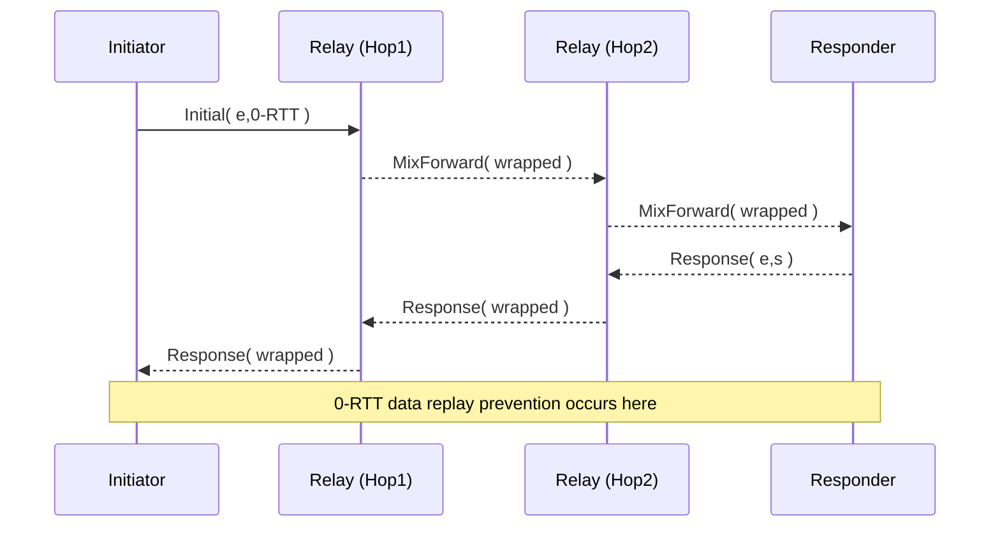

# Nyx Protocol v0.1 — Technical Specification (English Version)

> **"A next-generation anonymous transport protocol that unifies maximum privacy, secrecy, and performance."**

---

## Table of Contents
1. [Introduction](#1-introduction)
2. [Terminology](#2-terminology)
3. [Goals & Threat Model](#3-goals--threat-model)
4. [Architecture Overview](#4-architecture-overview)
5. [Layer-by-Layer Specification](#5-layer-by-layer-specification)  
   5.1 [Nyx Secure Stream Layer](#51-nyx-secure-stream-layer)  
   5.2 [Mix Routing Layer](#52-mix-routing-layer)  
   5.3 [Obfuscation + FEC Layer](#53-obfuscation--fec-layer)  
   5.4 [Transport Interface Layer](#54-transport-interface-layer)
6. [Addressing & Node Identity](#6-addressing--node-identity)
7. [Handshake & Cryptography](#7-handshake--cryptography)
8. [Packet Format](#8-packet-format)
9. [Error Handling](#9-error-handling)
10. [Formal Verification](#10-formal-verification)
11. [Implementation Guidelines](#11-implementation-guidelines)
12. [Internationalization](#12-internationalization)
13. [Extensibility & Compatibility](#13-extensibility--compatibility)
14. [Performance Targets](#14-performance-targets)
15. [License](#15-license)
16. [Management Frames](#16-management-frames)
17. [Handshake Sequence Diagram](#17-handshake-sequence-diagram)
18. [Test Vectors](#18-test-vectors)
19. [Congestion Control Parameters](#19-congestion-control-parameters)
20. [Extended Error Codes](#20-extended-error-codes)
21. [Security Considerations](#21-security-considerations)
22. [Conformance Test Suite](#22-conformance-test-suite)
23. [Future Extension Registry](#23-future-extension-registry)

---

## 1. Introduction
The Nyx Protocol integrates academic knowledge of high-anonymity networks with high-speed transport technologies (QUIC-compatible streams, multiplexing, 0-RTT key exchange, etc.) to provide an open protocol that enables secure and low-latency communication across environments from mobile to data centers.

This specification document describes the details at a fully implementable level for the v0.1 reference implementation (written in Rust, unsafe-free).

---

## 2. Terminology
| Term | Description |
|------|-------------|
| Node | An endpoint that speaks the Nyx protocol, including sending, receiving, and relaying. |
| Client / Server | Logical roles at the application layer. Nyx treats them as peers (P2P). |
| Stream | A logical data channel within Nyx Secure Stream, equivalent to QUIC Stream. |
| Session | State between two nodes sharing key material after handshake completion. |
| Hop | One relay node in the Mix Routing Layer. |
| CID | Connection ID. A 96-bit random value identifying a stream bundle. |
| Frame | The smallest unit of structured data carried by Nyx Secure Stream. |

---

## 3. Goals & Threat Model
### 3.1 Security Goals
* **Anonymity**: Hide sender, receiver, and path from observers.
* **Confidentiality**: Cryptographically conceal payload, packet length, and timing.
* **Integrity**: Detect transparent modifications.
* **Forward Secrecy**: Derive new keys for each stream, localizing impact of old key compromise.
* **Post-Quantum Ready**: Protocol allows switching to Post-Quantum KEM.

### 3.2 Threat Model
| Adversary | Capability |
|-----------|------------|
| Global Passive | Monitor all traffic, cannot modify. |
| Local Active | Partially modify/inject packets (e.g., Tor dropping attack equivalent). |
| Node Takeover | Control arbitrary relay nodes without key material. |
| Endpoint Compromise | Complete compromise of one endpoint. Prevent manual propagation to other nodes. |

---

## 4. Architecture Overview
```mermaid
flowchart TD
    A[Application Layer]
    B[Nyx Secure Stream \n (QUIC-like, 0-RTT)]
    C[Mix Routing Layer \n (3-5 hops, cover traffic)]
    D[Obfuscation + FEC Layer \n (fixed 1280B, RS-FEC)]
    E[Raw UDP / Custom UDP \n (NAT traversal)]
    A --> B --> C --> D --> E
```

Each layer has an independent state machine and is pipeline-processed using Rust's `async/await`.

---

## 5. Layer-by-Layer Specification
### 5.1 Nyx Secure Stream Layer
* **Frame Types**
  | ID | Name | Purpose |
  |----|------|---------|
  | 0x00 | PADDING | Bandwidth adjustment, pre-encryption insertion. |
  | 0x01 | STREAM | Application data. |
  | 0x02 | ACK | Acknowledgment, delayed ACK aggregation possible. |
  | 0x10 | CRYPTO | Handshake/key update. |

* **Connection ID**: 96-bit random, independent encryption state per CID.
* **0-RTT Key Exchange**: Modified Noise_IK (see §7). Early transmission with replay defense by response.
* **Flow Control**: BBRv2-derived delay-based control, avoiding DoS.

### 5.2 Mix Routing Layer
* **Route Length**: Minimum 3, standard 5 hops. Paths probabilistically selected from Kademlia DHT.
* **Batching**: Fixed delay Δ≤50 ms intervals with equal-sized packet mixing.
* **Cover Traffic**: Poisson(λ) dummy generation for pseudo-constant transmission volume.

### 5.3 Obfuscation + FEC Layer
* **Fixed-Length Packets**: Default 1280 B (IPv6 minimum MTU).
* **FEC**: Reed-Solomon (255,223) over GF(2⁸). Target 30% redundancy rate.
* **Timing Concealment**: Async send/receive queues + ±σ random delay for smoothing.

### 5.4 Transport Interface Layer
* **Basic Transport**: Single UDP socket. Ports 43300–43399 recommended.
* **NAT Traversal**: UDP Hole Punching + ICE Lite implementation. Specific procedure:
  1. Registration to Rendezvous server (report public, private EP).
  2. Endpoint exchange to both parties → parallel STUN Ping.
  3. Adopt first responding path, close other paths. Detailed algorithm references [Bryan Ford et al.].
* **Keep-Alive**: 12-byte PADDING frame transmission every 15 s. Assumes NAT idle ≥30 s.
* **Hairpin**: Direct local connection preferred on compatible NAPT.

---

## 6. Addressing & Node Identity
* **Node ID**: 256-bit. Uses first 256 bits of `BLAKE3(public_key)`.
* **Addressing**: DHT resolves NodeID → (IP, Port, CID List).
* **Version Negotiation**: `proto_version` (uint16) in first CRYPTO frame.

---

## 7. Handshake & Cryptography
| Item | Default Algorithm | Alternative (PQ) |
|------|------------------|------------------|
| DH | X25519 | Kyber1024 |
| AEAD | ChaCha20-Poly1305 | Ascon128a |
| Hash/KDF | SHA-256 + HKDF | BLAKE3 |

### 7.1 Noise_Nyx Pattern (Modified)
```
<- s
-> e, es, s, ss  (0-RTT possible)
<- e, ee, se, es
```
* **0-RTT Data**: Encrypted in STREAM Frame with `anti_replay_nonce` for replay prevention.

### 7.2 Key Rotation
* **Trigger**: 1 GiB transmission OR 10 min elapsed.
* **Method**: HKDF-Expand(label="Nyx-rekey", ck) → new AEAD key.

---

## 8. Packet Format
```
0               1               2               3
+---------------+---------------+---------------+---------------+
|  CID (96bit)                                          |
+---------------+---------------+---------------+---------------+
|Type| Flags |    Length (14bit)   |   Reserved   |
+---------------+---------------+---------------+---------------+
|            Encrypted Payload (≤1224B)                |
+---------------------------------------------------------------+
```
* `Type` (2bit): 0=Data,1=Control,2=Crypto,3=Reserved
* `Flags`: END_STREAM etc.
* `Length`: Payload size; padded to 1280B by Obfuscation layer.

---

## 9. Error Handling
| Code | Description | Sender Action |
|------|-------------|---------------|
| 0x00 | NO_ERROR | Graceful close |
| 0x01 | PROTOCOL_VIOLATION | Immediate session disconnect, reconnection allowed |
| 0x02 | FLOW_CONTROL_ERROR | Stop transfer, 30s back-off |
| 0x10 | CRYPTO_FAIL | Blacklist node (1h) |

---

## 10. Formal Verification
* **State Machine**: TLA+ description of Nyx Secure Stream handshake.
* **Safety Properties**: Confidentiality, key uniqueness, no recursive connections.
* **Model Checking**: TLC exhaustive check for 3-node topology, up to 5 hops.

---

## 11. Implementation Guidelines (Rust)
1. `#![forbid(unsafe_code)]` mandatory.  
2. Base on `tokio` runtime + `quinn` reference implementation.  
3. Send queue uses MPSC channel for back-pressure.  
4. Fuzz: `cargo-fuzz`, Coverage >90%.  
5. Integrate Miri undefined behavior verification into CI pipeline.

---

## 12. Internationalization
* **Character Encoding**: UTF-8 only permitted.
* **Message Localization**: STREAM Frame Type=0x20 `LOCALIZED_STRING` can include `lang_tag` (BCP-47).
* **Error Encoding**: Combined code + I18N string TLV.

---

## 13. Extensibility & Compatibility
* **Configuration Negotiation**: Feature advertisement via CRYPTO extension TLV.
* **Future Versions**: Return `VERSION_MISMATCH` (0x03) and close on unsupported `proto_version`.
* **Extension Frames**: Reserve `Type=3` area, identify with `Experiment ID` (16bit).

---

## 14. Performance Targets
| Metric | Target |
|--------|--------|
| Handshake Roundtrips | ≤ 1 RTT |
| Throughput (1 hop) | ≥ 90% of UDP raw |
| Additional Latency (5 hops) | < 50 ms |
| Bandwidth Overhead | ≤ 40% |

---

## 15. License
Nyx Protocol specification and reference implementation are provided under **MIT / Apache-2.0** dual license.

---

## 16. Management Frames
| Type (hex) | Name | Fields | Description |
|------------|------|--------|-------------|
| 0x30 | SETTINGS | list<Setting> | Bulk configuration advertisement at protocol startup. |
| 0x31 | PING | nonce (64bit) | RTT measurement/keep-alive. Reply with PONG. |
| 0x32 | PONG | nonce (64bit) | PING response. |
| 0x33 | PATH_CHALLENGE | token (128bit) | New path availability confirmation. |
| 0x34 | PATH_RESPONSE | token (128bit) | CHALLENGE response. |
| 0x3F | CLOSE | code (16bit), reason_len (8), reason | Connection termination notification. |

`Setting` is (id:uint16, value:uint32) TLV. Default IDs: 0x0001=MAX_STREAMS, 0x0002=MAX_DATA, 0x0003=IDLE_TIMEOUT.

---

## 17. Handshake Sequence Diagram


---

## 18. Test Vectors
### 18.1 Noise_Nyx Handshake (X25519 + ChaCha20-Poly1305)
| Field | Hex Value |
|-------|-----------|
| prologue | 4e 79 78 30 2e 31 |
| s (B) | 11..22 (32B) |
| e (A) | aa..bb (32B) |
| ... | |

Complete capture reference: `tests/handshake_vec1.pcapng`.

---

## 19. Congestion Control Parameters
* RTT sample window: 8
* BBRv2 pacing_gain cycle: `[1.25, 0.75]`
* CWND minimum: 4 * 1280B
* ECN CE flag threshold: 5%

---

## 20. Extended Error Codes
| Code | Description |
|------|-------------|
| 0x04 | VERSION_MISMATCH | Incompatible protocol version |
| 0x05 | PATH_VALIDATION_FAILED | New path validation failed |
| 0x06 | INTERNAL_ERROR | Implementation-side unclassified error |

---

## 21. Security Considerations
* **Traffic Correlation**: In addition to fixed-length + Cover Traffic, use independent random sequences per link to make Padding Bytes invisible.
* **Replay Protection**: CRYPTO frame sequence (64-bit) and anti_replay_nonce (96-bit) maintain window 2^20.
* **Key Compromise**: For perfect forward secrecy, generate individual keys per stream using `HKDF-Expand(ck,stream_id)`.
* **Quantum Readiness**: Rollover to Kyber series after advertising `PQ_SUPPORTED=1` in SETTINGS, followed by re-handshake.

---

## 22. Conformance Test Suite
* `cargo test --features conformance` for 120 cases.
* Categories: Handshake, Frame Parsing, Error Propagation, Congestion Control, FEC Recovery, NAT Traversal.
* CI requires WebAssembly implementation to pass same tests using `wasmtime`.

---

## 23. Future Extension Registry
| Range | Usage |
|-------|-------|
| Frame Type 0x40–0x4F | Internal experiments (unpublished) |
| Error Code 0x40–0x4F | Research-stage extensions |
| Setting ID 0x8000–0xFFFF | Private Use |

---

This completes the full specification of Nyx Protocol v0.1. Future changes must update `proto_version` to 0x0002 or later while maintaining backward compatibility mode.
